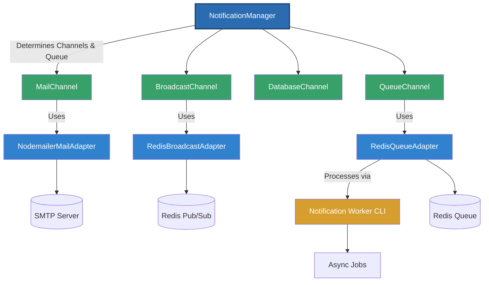

# @voxcape/nestjs-notifications

A Laravel-inspired notifications layer for NestJS that orchestrates mail, broadcast, and queue delivery with plug-and-play adapters.

## Highlights

- Laravel-style channel builders (`toMail`, `toBroadcast`, `toDatabase`) for expressive notifications
- Drop-in NestJS module prewired with Nodemailer, Redis queue, and Redis broadcast adapters
- Queue opt-in via `shouldQueue()` plus per-notification retry/backoff controls
- Extensible injection tokens to swap adapters or register custom channels
- CLI worker built on nest-commander for resilient background processing

## Project status

This library is still in an experimental, "beta-ish" phase while we validate more real-world workloads.
Core features—mail delivery, Redis-backed broadcasting, queue retries, and the worker—are exercised in production-style environments and backed by automated tests, so you can rely on them for critical paths today.
Expect some APIs to evolve as we keep refining ergonomics; we document breaking changes quickly and aim to keep upgrades smooth.

## Architecture Overview
The following diagram shows how @voxcape/nestjs-notifications works internally:




## Installation

Requires Node.js 20+, NestJS 11, and TypeScript 5.

```bash
npm install @voxcape/nestjs-notifications
```

The package lists `@nestjs/common`, `@nestjs/core`, `rxjs`, `nodemailer`, and `reflect-metadata` as peer dependencies; install them if they are not already present in your workspace.

Redis-powered features rely on optional adapters:

```bash
npm install ioredis           # queue + broadcast defaults
```

Add `import 'reflect-metadata';` once at your application entrypoint and ensure your `tsconfig.json` enables decorators:

```json
{
    "compilerOptions": {
        "experimentalDecorators": true,
        "emitDecoratorMetadata": true
    }
}
```

## Quick Start

Register the module in your root application module. Built-in providers register the mail, database, and broadcast channels plus Redis-backed queueing.

```ts
import { Module } from '@nestjs/common';
import {
    NotificationModule,
    DATABASE_ADAPTER,
} from '@voxcape/nestjs-notifications';
import { PrismaNotificationsAdapter } from './prisma/prisma-notifications.adapter';

@Module({
    imports: [
        NotificationModule.forRoot({
            databaseAdapter: {
                provide: DATABASE_ADAPTER,
                useClass: PrismaNotificationsAdapter,
            },
        }),
    ],
})
export class AppModule {}
```

`NotificationModule.forRoot()` accepts either provider objects or Nest classes. You can extend the channel pipeline by passing additional providers through the `channels` option.

## Async Configuration

Use `forRootAsync` when configuration depends on runtime values, external services, or dependency injection.

**useFactory** - Inline function with dependency injection:

```ts
NotificationModule.forRootAsync({
    imports: [ConfigModule],
    useFactory: (config: ConfigService) => ({
        autoDiscoverNotifications: config.get('AUTO_DISCOVER'),
        worker: {
            enabled: config.get('WORKER_ENABLED'),
            blockTimeoutSeconds: config.get('WORKER_TIMEOUT'),
        },
        databaseAdapter: {
            provide: DATABASE_ADAPTER,
            useClass: PrismaNotificationsAdapter,
        },
    }),
    inject: [ConfigService],
})
```

**useClass** - Reusable factory class:

```ts
@Injectable()
class NotificationConfigService implements NotificationOptionsFactory {
    constructor(private config: ConfigService) {}

    async createNotificationOptions(): Promise<NotificationModuleOptions> {
        return {
            worker: { enabled: this.config.get('WORKER_ENABLED') },
            autoDiscoverNotifications: false,
        };
    }
}

NotificationModule.forRootAsync({
    imports: [ConfigModule],
    useClass: NotificationConfigService,
})
```

**useExisting** - Reuse an existing provider:

```ts
NotificationModule.forRootAsync({
    imports: [ConfigModule],
    useExisting: NotificationConfigService,
})
```

## Creating a notification

Notifications declare which channels they use and how to render payloads per channel. Override `shouldQueue()` when you want the notification processed through the queue.

```ts
import {
    BaseNotification,
    MailMessage,
} from '@voxcape/nestjs-notifications';
import { User } from '../users/user.entity';
import { Invoice } from '../billing/invoice.entity';

export class InvoicePaidNotification extends BaseNotification<User> {
    retryLimit = 3;
    delaySeconds = 5;

    constructor(private readonly invoice: Invoice) {
        super();
    }

    shouldQueue(): boolean {
        return true;
    }

    shouldRetry(error: Error, attempt: number): boolean {
        return !error.message.includes('fatal') && attempt <= this.retryLimit;
    }

    backoff(attempt: number): number {
        return this.delaySeconds * Math.pow(2, attempt);
    }

    channels(): string[] {
        return ['mail', 'broadcast'];
    }

    toMail(recipient: User): MailMessage {
        return {
            subject: `Invoice #${this.invoice.id} paid`,
            to: recipient.email,
            text: `Thanks ${recipient.name}, we received your payment.`,
            html: `<p>Thanks ${recipient.name}, we received your payment.</p>`,
        };
    }

    toBroadcast(recipient: User) {
        return {
            event: 'invoice.paid',
            data: {
                invoiceId: this.invoice.id,
                amount: this.invoice.total,
            },
        };
    }

    broadcastOn(recipient: User) {
        return [`users.${recipient.id}`];
    }
}
```

Setting `retryLimit` caps the number of requeue attempts. `delaySeconds` defines the initial delay before retrying and seeds the default exponential backoff. Override `shouldRetry` to short-circuit retries for specific errors, and `backoff` to customize the delay that will be passed to the queue adapter on each attempt.

## Dispatching notifications

Inject `NotificationManager` anywhere in your Nest application to send notifications to a `RecipientLike` (email, id, or arbitrary data). Passing `skipQueue = true` bypasses the queue adapter even for queueable notifications.

```ts
import { Injectable } from '@nestjs/common';
import { NotificationManager } from '@voxcape/nestjs-notifications';

@Injectable()
export class BillingService {
    constructor(private readonly notifications: NotificationManager) {}

    async markInvoicePaid(invoice: Invoice, user: User): Promise<void> {
        await this.notifications.send(
            new InvoicePaidNotification(invoice),
            {
                id: user.id,
                email: user.email,
            },
        );
    }
}
```

## Working with queues

If a queue adapter is registered and `shouldQueue()` returns true, `NotificationManager` enqueues the job automatically.

When a queued job fails, the manager reschedules it using the notification's `retryLimit`, `delaySeconds`, `shouldRetry`, and `backoff` hooks. Failures are enqueued with an incremented attempt counter and the computed delay so adapters like `RedisQueueAdapter` can delay the next attempt.

There are two ways to run the worker that processes queued jobs:

1) Run the worker inside your Nest app process (quick start)

Enable the built-in worker to start as part of your application lifecycle. This is convenient for local development or very small deployments, but not recommended for production.

```ts
import { Module } from '@nestjs/common';
import { NotificationModule } from '@voxcape/nestjs-notifications';

@Module({
  imports: [
    NotificationModule.forRoot({
      worker: {
        enabled: true,
        // Optional: override the Redis BRPOP block timeout (seconds)
        blockTimeoutSeconds: 10,
      },
    }),
  ],
})
export class AppModule {}
```

Warning: Running the worker in the same process as your HTTP server can starve the event loop under load, complicate horizontal scaling, and make graceful shutdown harder. Prefer a dedicated worker process in production.

2) Run the worker as a separate process (recommended)

The library ships with a nest-commander command (notifications:work). To use it, wire the command into your own application entrypoint and launch it as a separate process.

Example CLI bootstrap in your app:

```ts
// src/main.cli.ts (in your app)
import 'reflect-metadata';
import { CommandFactory } from 'nest-commander';
import { AppModule } from './app.module';

async function bootstrap() {
  await CommandFactory.run(AppModule, ['warn', 'error', 'debug', 'log']);
}
bootstrap();
```

Notes:
- Ensure your AppModule imports NotificationModule.forRoot(...) so the worker command is registered.
- You can also call CommandFactory.run(NotificationModule.forRoot(...)) directly in tiny apps, but using AppModule is typical.
- Pass CLI flags after a double dash. For example, to change the block timeout:

```bash
node dist/main.cli.js notifications:work -- --block-timeout 10
```

How it works: Jobs are pulled from Redis (via REDIS_QUEUE_KEY). When a job is dequeued, the worker republishes it to the NotificationManager with skipQueue = true, ensuring idempotent processing.

## Notification discovery and type registration

The NotificationModule supports both automatic discovery of notification types and explicit registration. This gives you flexibility to tailor discovery to your project structure and performance needs.

Options available in NotificationModule.forRoot(...):

- autoDiscoverNotifications (boolean, default: true)
  - When true, the module scans your project for notification classes at startup. When false, no scanning occurs.
- notificationAutoDiscoverDirectories (string[], default: ['dist', 'src'])
  - Directories to scan when autoDiscoverNotifications is enabled. In production builds, scanning dist first finds compiled files quickly; in dev, src is also scanned.
- notificationTypes (Type<unknown>[])
  - An explicit list of notification classes to register. These are registered before auto-discovery runs.

How it works internally:

- On module init, any types provided via notificationTypes are registered first.
- If autoDiscoverNotifications is true (the default), a discovery pass scans the specified directories for additional notification classes.

Common configurations

- Default behavior (auto-discovery enabled):

```ts
NotificationModule.forRoot();
```

- Disable auto-discovery and only register specific notifications:

```ts
import { WelcomeNotification, InvoicePaidNotification } from './notifications';

NotificationModule.forRoot({
  autoDiscoverNotifications: false,
  notificationTypes: [WelcomeNotification, InvoicePaidNotification],
});
```

- Keep auto-discovery but narrow the search to specific folders for speed in large repos or monorepos:

```ts
NotificationModule.forRoot({
  notificationAutoDiscoverDirectories: ['dist/apps/api', 'dist/libs/notifications'],
});
```

When to prefer manual registration over auto-discovery

- Performance-sensitive startups: Avoid scanning large codebases or monorepos by explicitly registering only the types you need.
- Tree-shaking and bundle control: In serverless or edge environments, manual registration can help keep cold start small and deterministic.
- Restricted environments: If the runtime cannot access the filesystem (e.g., certain serverless platforms), disable discovery and register types manually.
- Security and tenancy: In multi-tenant systems you may wish to register only a curated set of notifications for a tenant or environment.
- Testing: In unit tests, explicitly register only the notifications under test to avoid side effects from discovery.

Tip: You can combine both. Provide notificationTypes for critical types, and leave autoDiscoverNotifications enabled to pick up the rest during local development. In CI/production, you might turn discovery off and keep only explicit registration for speed.

## Channels and adapters

The module ships with three core channels:

| Channel    | Default adapter               | Override token          | Notes                                               |
|------------|-------------------------------|-------------------------|-----------------------------------------------------|
| Mail       | `NodemailerMailAdapter`       | `MAIL_ADAPTER`          | Plug in transactional providers such as SES, Resend |
| Database   | _none provided_               | `DATABASE_ADAPTER`      | Supply your own persistence adapter                 |
| Broadcast  | `RedisBroadcastAdapter`       | `BROADCAST_ADAPTER`     | Publish real-time payloads to Redis channels        |

Queueing uses `RedisQueueAdapter` by default and can be replaced via the `QUEUE_ADAPTER` token.

Custom channels can be registered by passing the class or provider definition through `NotificationModule.forRoot({ channels: [WebhookChannel] })`. The array is merged with the built-in channels and injected via `NOTIFICATION_CHANNELS`.

## Environment variables

| Variable                      | Description                                  | Default                     |
|------------------------------|----------------------------------------------|-----------------------------|
| `MAIL_HOST`                  | SMTP host for Nodemailer                     | _required_                  |
| `MAIL_PORT`                  | SMTP port (465 triggers TLS)                 | `587`                       |
| `MAIL_USERNAME`              | SMTP username                                | _required_                  |
| `MAIL_PASSWORD`              | SMTP password                                | _required_                  |
| `MAIL_FROM`                  | Default sender address                       | `"App" <no-reply@app.com>` |
| `REDIS_HOST`                 | Redis host for queue and broadcast           | `127.0.0.1`                 |
| `REDIS_PORT`                 | Redis port                                   | `6379`                      |
| `REDIS_CHANNEL_PREFIX`       | Prefix for broadcast channels                | `notifications`             |
| `REDIS_QUEUE_KEY`            | Redis list key for queued jobs               | `notifications:queue`       |
| `REDIS_QUEUE_BLOCK_TIMEOUT`  | Seconds to block while waiting for jobs      | `5`                         |
| `QUEUE_BLOCK_TIMEOUT`        | CLI override for dequeue blocking            | `5`                         |

Leverage the exported `env()` helper when building custom adapters so configuration stays centralized.

## Scripts

| Command             | Description                                     |
|---------------------|-------------------------------------------------|
| `npm run build`     | Compile TypeScript sources into `dist/`         |
| `npm test`          | Execute the Jest test suite                     |
| `npm run clean`     | Remove build artifacts                          |

## Testing

Jest (`ts-jest`) powers the test suite. Use `npm test -- --watch` for TDD or `npm test -- --runInBand` when debugging asynchronous queue behaviour. Adapters are designed to be mocked with `jest.spyOn` or light in-memory doubles.

## Package exports

Everything is re-exported from the package entry (`src/index.ts`), including the Nest module, channels, adapters, injection tokens, the CLI command, and utilities such as `ensureArray` and `env`.

## License

Released under the [MIT License](LICENSE.md).
